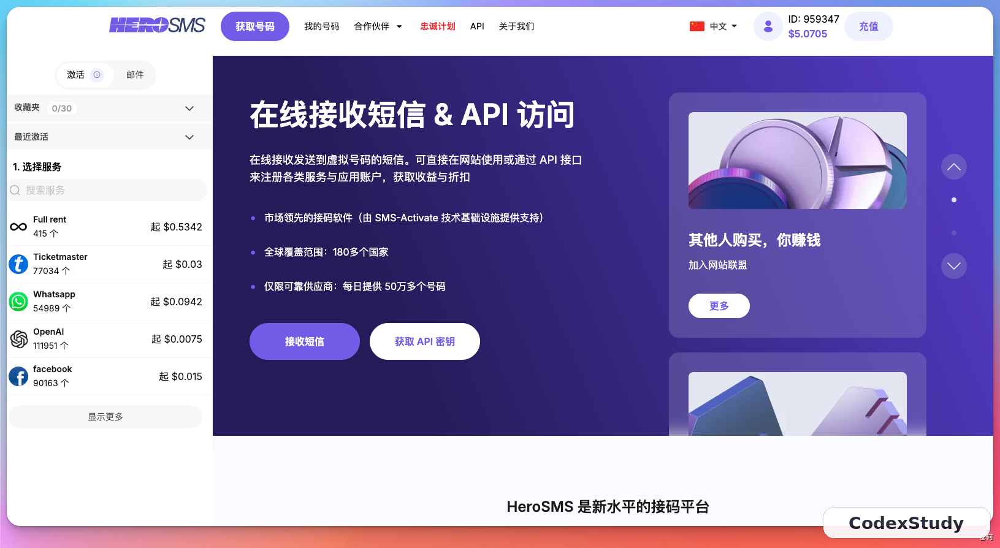
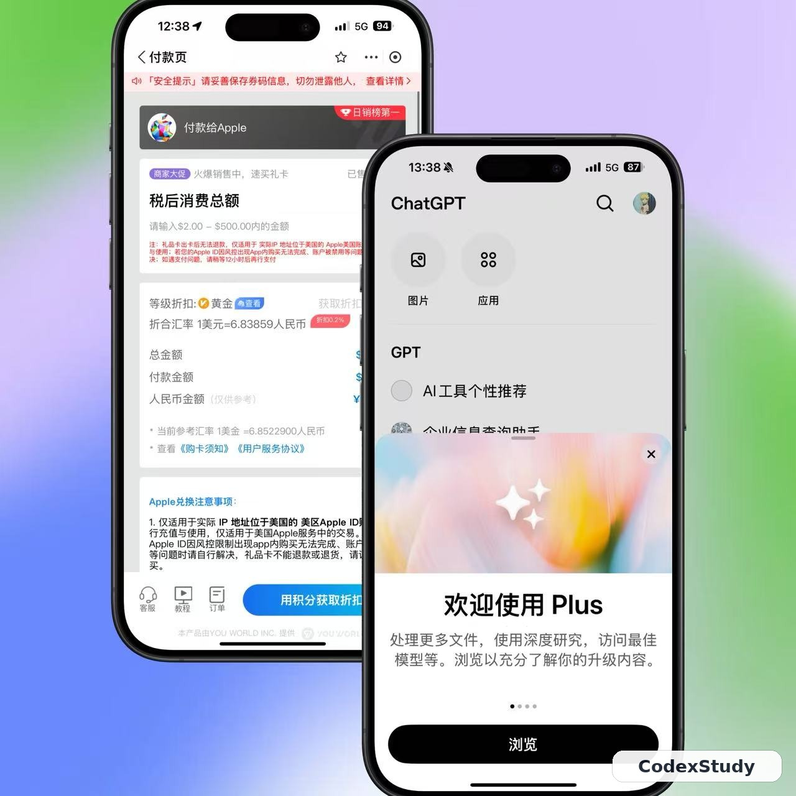
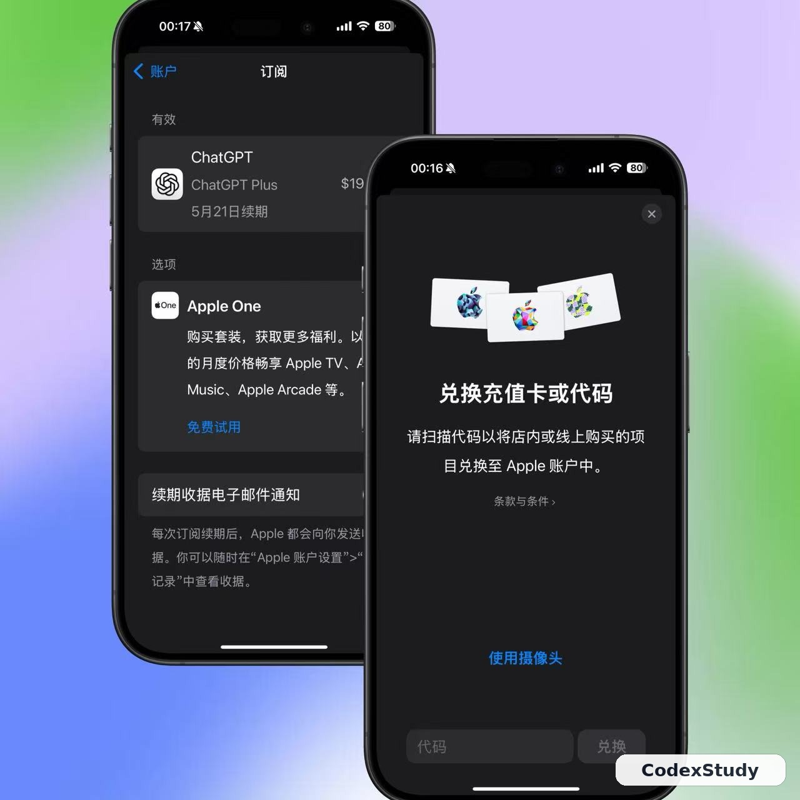

# 订阅 ChatGPT Plus / Pro

::: tip 最后核对
官方资料最后核对日期：2026-05-27。定价与套餐以 [ChatGPT 定价页](https://chatgpt.com/pricing/) 和 [Using Codex with your ChatGPT plan](https://help.openai.com/en/articles/11369540-using-codex-with-your-chatgpt-plan) 为准。
:::

## 为什么需要订阅

免费版 ChatGPT 可以体验基础对话，但 Codex 功能（包括桌面 App、Cloud 任务、多 agent 并行）需要付费套餐才能稳定使用。

| 套餐 | 月费（美元） | Codex 可用情况 |
| --- | --- | --- |
| Free | 免费 | 仅限试用，额度极少 |
| Go | $8 | 有限额度，可体验 Codex |
| Plus | $20 | 完整 Codex 访问，日常开发够用 |
| Pro | $200 | Plus 的 5 倍额度，高强度使用 |
| Team / Enterprise | 按人计费 | 完整访问，含团队管理 |

对大多数个人开发者来说，**Plus（$20/月）是性价比最高的起点**。

## 前提条件

- 能正常访问国际网络（需要代理工具，这里不展开）
- 一个注册好的 ChatGPT / OpenAI 账号
- 支持国际支付的方式（详见下方）

如果还没有账号，需要先准备一个国外手机号用于接收注册验证码，可以使用专门的接码平台完成注册。

>可以试试：https://hero-sms.com

## 方法一：苹果礼品卡（最稳定，推荐优先尝试）

适合已有 iOS 设备或愿意准备一台的用户。整个流程在国内支付宝内完成充值，不需要境外银行卡。

**准备物品：**

- 一台苹果设备（iPhone / iPad，可以是二手，能正常使用 App Store 即可）
- 已注册好的海外区 Apple ID（注册时选美国或新加坡，不需要绑定国内手机号）
- 国内支付宝（正常使用即可）

**操作步骤：**

1. 在苹果设备上退出国内 Apple ID，登录准备好的海外区 Apple ID
2. 打开支付宝，将定位切换为「美国旧金山」，支付宝会自动切换为国际版界面
3. 在支付宝功能区找到「苹果礼品卡」，购买 $20 额度
4. 购买成功后复制兑换码，打开 App Store，点击头像 → 「兑换礼品卡或代码」，粘贴充值
5. 打开 ChatGPT App，登录账号，进入设置订阅 Plus，选择 Apple ID 余额支付

给Apple id充值礼品卡：

::: tip
如果支付宝购买偶尔不稳定，可以通过代理访问苹果官网直接购买礼品卡，一次性多充值几个月额度，后续续订不需要重复操作。
:::

## 方法二：安卓 Google Play（备选）

逻辑与苹果礼品卡类似：在安卓设备上切换到对应 Google 账号区域，通过 Google Play 购买礼品卡充值后订阅。有部分用户反映这条路可行，但实测稳定性不如苹果礼品卡，可作为备选方案。

## 常见问题

**Q：订阅后 Codex 额度够用吗？**

Plus 按 token 计费（2026 年 4 月起），日常开发任务普通使用量通常可以撑一整个月。如果额度用完，可以单独购买额外额度，也可以等下月重置。

**Q：Plus 和 Pro 区别大吗？**

Pro 的 Codex 使用额度是 Plus 的 5 倍，适合重度用户或需要大量并行任务的场景。普通开发者先从 Plus 开始，不够用再升级。

**Q：可以用现有手机而不买二手设备吗？**

可以。如果你的设备能正常使用海外区 Apple ID，不需要专门买二手。建议不要在自己常用的国内账号设备上频繁切换 ID，长期使用建议准备一台专用设备。

## 订阅后验证

登录 ChatGPT App 或网页端，在账号设置里确认套餐显示为 Plus 或以上，然后进入 Codex 入口检查功能是否正常可用。
